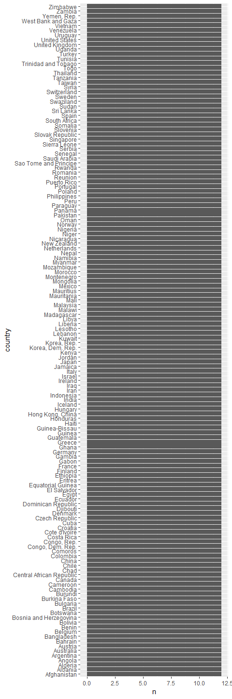
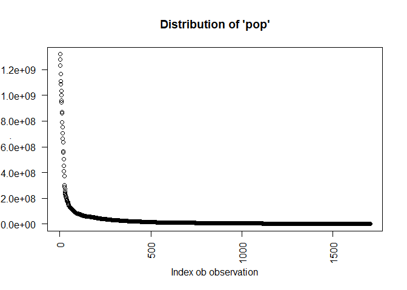
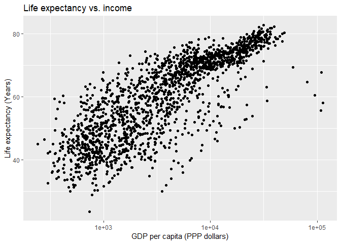
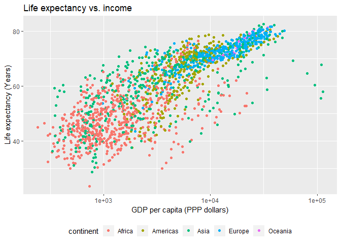
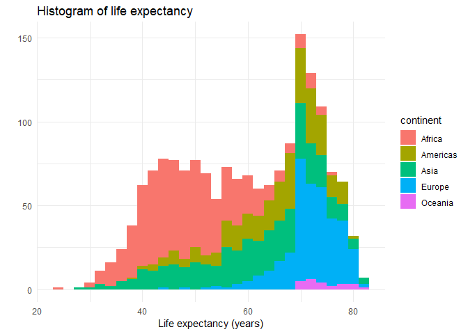
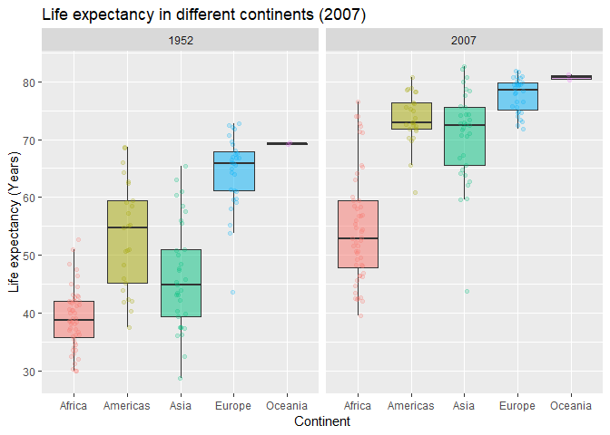

hw02
================
@RetoSterchi
September 22, 2018

Homework 02: Explore Gapminder and use dplyr
============================================

Step 1: Load packages
---------------------

``` r
require(gapminder)
require(ggplot2)
require(dplyr)
```

Step 2: Explore basic structure of data set
-------------------------------------------

Let's explore the `gapminder` object:

``` r
str(gapminder)
```

    ## Classes 'tbl_df', 'tbl' and 'data.frame':    1704 obs. of  6 variables:
    ##  $ country  : Factor w/ 142 levels "Afghanistan",..: 1 1 1 1 1 1 1 1 1 1 ...
    ##  $ continent: Factor w/ 5 levels "Africa","Americas",..: 3 3 3 3 3 3 3 3 3 3 ...
    ##  $ year     : int  1952 1957 1962 1967 1972 1977 1982 1987 1992 1997 ...
    ##  $ lifeExp  : num  28.8 30.3 32 34 36.1 ...
    ##  $ pop      : int  8425333 9240934 10267083 11537966 13079460 14880372 12881816 13867957 16317921 22227415 ...
    ##  $ gdpPercap: num  779 821 853 836 740 ...

Based on this query we can see that the `gapminder` object has three classes specified: 'classic' data.frame as well as the more 'modern' dplyr versions 'tbl\_df' and 'tbl'.

We can find a in-depth description of tibbles under: <https://cran.r-project.org/web/packages/tibble/vignettes/tibble.html>

The data frame has 1704 rows/observations and contains 6 variables/columns. We can see this information from the summary output above. If we do not want to get the entire summary output every time we need this informations we can also access it directly through:

``` r
# Explore dimensions
nrow(gapminder) # number of rows?
```

    ## [1] 1704

``` r
ncol(gapminder) # number of columns?
```

    ## [1] 6

``` r
dim(gapminder) # get both dimensions?
```

    ## [1] 1704    6

``` r
# Example application: What is the last column name?
colnames(gapminder)[ncol(gapminder)]
```

    ## [1] "gdpPercap"

The six variables of the dataframe are of different type:

-   *country* is a factor with 142 levels
-   *continent* is a factor with 5 levels
-   *year* spans the period from 1952 to 2007 in increments of 5 years
-   *pop* is the population per country and year
-   *gdpPercap* GDP per capita
-   *lifeExp* is the life expectancy in years

Step 3: Let's explore individual variables
------------------------------------------

Let's explore the variable 'country' first:

``` r
str(gapminder$country)
```

    ##  Factor w/ 142 levels "Afghanistan",..: 1 1 1 1 1 1 1 1 1 1 ...

It is a factor with 142 levels, each containing a country. Once thing we could check for this type of variable is if the values are evenly distributed (i.e., do we have complete records for every country for the entire time span of the data set?).

``` r
head(table(gapminder$country)) ## Looks like we should have 12 records for every country
```

    ## 
    ## Afghanistan     Albania     Algeria      Angola   Argentina   Australia 
    ##          12          12          12          12          12          12

``` r
## Let's check 
min(table(gapminder$country))
```

    ## [1] 12

``` r
max(table(gapminder$country))
```

    ## [1] 12

We could also do a quick visual check if that is more appealing:

``` r
gapminder %>% 
  group_by(country) %>% 
  summarise(n = n()) %>% 
  ggplot(aes(x = country, y = n)) +
  geom_col() +
  coord_flip()
```



Cool beans, we can adjust the graph size by adding height and width into the brackets at the beginning of a new R chunk (e.g. {r fig.height = 15, fig.width = 5})

Let's have a glance at the variable 'pop':

``` r
str(gapminder$pop)
```

    ##  int [1:1704] 8425333 9240934 10267083 11537966 13079460 14880372 12881816 13867957 16317921 22227415 ...

It seems to be an numeric variable, integer type. What is its range and how is it distributed?

``` r
range(gapminder$pop)
```

    ## [1]      60011 1318683096

``` r
mean(gapminder$pop)
```

    ## [1] 29601212

``` r
min(gapminder$pop)
```

    ## [1] 60011

``` r
max(gapminder$pop)
```

    ## [1] 1318683096

``` r
sd(gapminder$pop)
```

    ## [1] 106157897

And again, let's make a quick plot just to get a visual sense of the variable.

``` r
gapminder$pop %>% 
  sort(decreasing = T) %>% 
  plot(las = 2, main = "Distribution of 'pop'", xlab = "Index ob observation")
```



Explore various plot types
--------------------------

Make a few plots, probably of the same variable you chose to characterize numerically. You can use the plot types we went over in class (cm006) to get an idea of what you'd like to make. Try to explore more than one plot type. **Just as an example** of what I mean:

### A scatterplot of two quantitative variables.

``` r
# Let's plot life expentancy vs. GDP per capita
gapminder %>% 
  ggplot(aes(x = gdpPercap, y = lifeExp)) +
  geom_point() +
  ggtitle("Life expectancy vs. income") +
  xlab("GDP per capita (PPP dollars)") +
  ylab("Life expectancy (Years)") +
  scale_x_log10() # use a log scale
```



Same thing, but let's add some color.

``` r
# Let's plot life expentancy vs. GDP per capita
gapminder %>% 
  ggplot(aes(x = gdpPercap, y = lifeExp)) +
  geom_point(aes(colour = continent)) +
  ggtitle("Life expectancy vs. income") +
  xlab("GDP per capita (PPP dollars)") +
  ylab("Life expectancy (Years)") +
  scale_x_log10()  + # use a log scale
  theme(legend.position="bottom") # remove legend
```



### A plot of one quantitative variable

``` r
qplot(lifeExp, data = gapminder, fill = continent, binwidth = 2) +
  ggtitle("Histogram of life expectancy") +
  xlab("Life expectancy (years)") +
  theme_minimal()
```



### A plot of one quantitative variable and one categorical.

Let's have a closer look at the distribution of the life expectancy values for the different continents:

``` r
gapminder %>% 
  filter(year == 2007 | year == 1952) %>% # subset to these two years
  ggplot(aes(x = continent, y = lifeExp, fill = continent)) +
    geom_boxplot(alpha = 0.5, outlier.colour = NA) + # let's make a boxplot
    geom_jitter(position = position_jitter(width = 0.1, height = 0), 
                aes(colour = continent), alpha = 0.2) + # add point with some jitter around the continents
  ggtitle("Life expectancy in different continents (2007)") + # add title
  xlab("Continent") + # x-axis label
  ylab("Life expectancy (Years)") + # y-axis label
  facet_wrap(.~year) + # arrange by year
  theme(legend.position="none") # remove legend
```



Use `filter()`, `select()` and `%>%`
------------------------------------

Let's get rid of the two countries in Oceania and make the above plot a bit nicer.

``` r
levels(gapminder$continent)
```

    ## [1] "Africa"   "Americas" "Asia"     "Europe"   "Oceania"

``` r
gapminder %>% 
    select(continent, year, lifeExp) %>% 
    filter(!(continent == "Oceania")) %>% 
    filter(year == 2007 | year == 1952) %>% # subset to these two years
    ggplot(aes(x = continent, y = lifeExp, fill = continent)) +
      geom_boxplot(alpha = 0.5, outlier.colour = NA, notch = T) + # let's make a boxplot, with notch
      geom_jitter(position = position_jitter(width = 0.1, height = 0), 
                  aes(colour = continent), alpha = 0.2) + # add point with some jitter around the continents
  ggtitle("Life expectancy in different continents (2007)") + # add title
  xlab("Continent") + # x-axis label
  ylab("Life expectancy (Years)") + # y-axis label
  facet_wrap(.~year) + # arrange by year
  theme(legend.position="none") # remove legend
```

    ## notch went outside hinges. Try setting notch=FALSE.
    ## notch went outside hinges. Try setting notch=FALSE.


But I want to do more!
----------------------

Evaluate this code and describe the result. Presumably the analyst's intent was to get the data for Rwanda and Afghanistan. Did they succeed? Why or why not? If not, what is the correct way to do this?

    filter(gapminder, country == c("Rwanda", "Afghanistan"))

I would assume that this query will not return the proper result. However, the second or third one should do. Let's compare the different outputs.

``` r
# Version 1
filter(gapminder, country == c("Rwanda", "Afghanistan"))
```

    ## # A tibble: 12 x 6
    ##    country     continent  year lifeExp      pop gdpPercap
    ##    <fct>       <fct>     <int>   <dbl>    <int>     <dbl>
    ##  1 Afghanistan Asia       1957    30.3  9240934      821.
    ##  2 Afghanistan Asia       1967    34.0 11537966      836.
    ##  3 Afghanistan Asia       1977    38.4 14880372      786.
    ##  4 Afghanistan Asia       1987    40.8 13867957      852.
    ##  5 Afghanistan Asia       1997    41.8 22227415      635.
    ##  6 Afghanistan Asia       2007    43.8 31889923      975.
    ##  7 Rwanda      Africa     1952    40    2534927      493.
    ##  8 Rwanda      Africa     1962    43    3051242      597.
    ##  9 Rwanda      Africa     1972    44.6  3992121      591.
    ## 10 Rwanda      Africa     1982    46.2  5507565      882.
    ## 11 Rwanda      Africa     1992    23.6  7290203      737.
    ## 12 Rwanda      Africa     2002    43.4  7852401      786.

``` r
# Version 2
filter(gapminder, country %in% c("Rwanda", "Afghanistan"))
```

    ## # A tibble: 24 x 6
    ##    country     continent  year lifeExp      pop gdpPercap
    ##    <fct>       <fct>     <int>   <dbl>    <int>     <dbl>
    ##  1 Afghanistan Asia       1952    28.8  8425333      779.
    ##  2 Afghanistan Asia       1957    30.3  9240934      821.
    ##  3 Afghanistan Asia       1962    32.0 10267083      853.
    ##  4 Afghanistan Asia       1967    34.0 11537966      836.
    ##  5 Afghanistan Asia       1972    36.1 13079460      740.
    ##  6 Afghanistan Asia       1977    38.4 14880372      786.
    ##  7 Afghanistan Asia       1982    39.9 12881816      978.
    ##  8 Afghanistan Asia       1987    40.8 13867957      852.
    ##  9 Afghanistan Asia       1992    41.7 16317921      649.
    ## 10 Afghanistan Asia       1997    41.8 22227415      635.
    ## # ... with 14 more rows

``` r
# Version 3
filter(gapminder, country == "Rwanda" | country == "Afghanistan")
```

    ## # A tibble: 24 x 6
    ##    country     continent  year lifeExp      pop gdpPercap
    ##    <fct>       <fct>     <int>   <dbl>    <int>     <dbl>
    ##  1 Afghanistan Asia       1952    28.8  8425333      779.
    ##  2 Afghanistan Asia       1957    30.3  9240934      821.
    ##  3 Afghanistan Asia       1962    32.0 10267083      853.
    ##  4 Afghanistan Asia       1967    34.0 11537966      836.
    ##  5 Afghanistan Asia       1972    36.1 13079460      740.
    ##  6 Afghanistan Asia       1977    38.4 14880372      786.
    ##  7 Afghanistan Asia       1982    39.9 12881816      978.
    ##  8 Afghanistan Asia       1987    40.8 13867957      852.
    ##  9 Afghanistan Asia       1992    41.7 16317921      649.
    ## 10 Afghanistan Asia       1997    41.8 22227415      635.
    ## # ... with 14 more rows

As expected, the first one does not quite do the job and misses half of the results. The latter two queries both return 24 data entries which supports that this would be the correct approach. Conceptually, we want to get the results for both Rwanda or Afghanistan. We can write the filter criteria like this (version 3) or make a vector of these two countries and specify the filter that it should return countries that are 'in' that vector (version 2).
