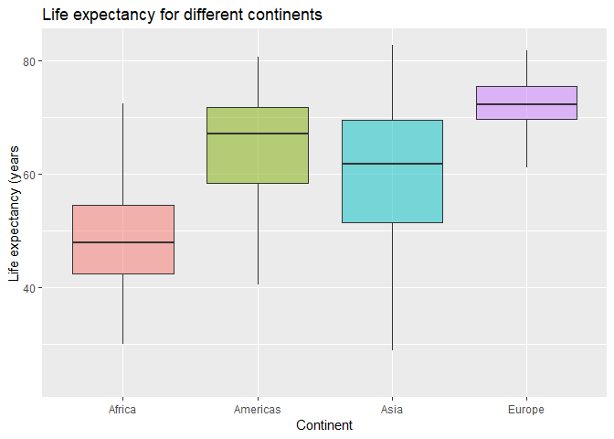
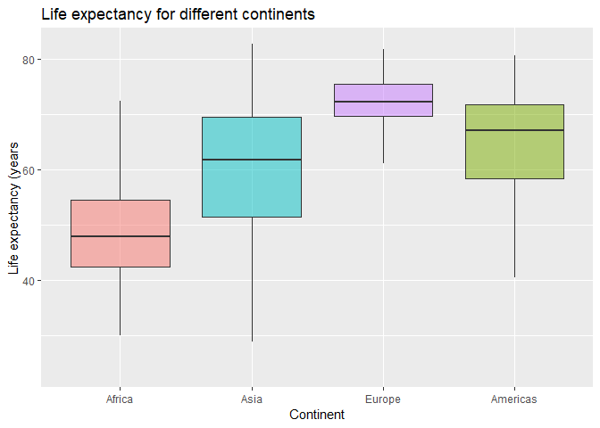
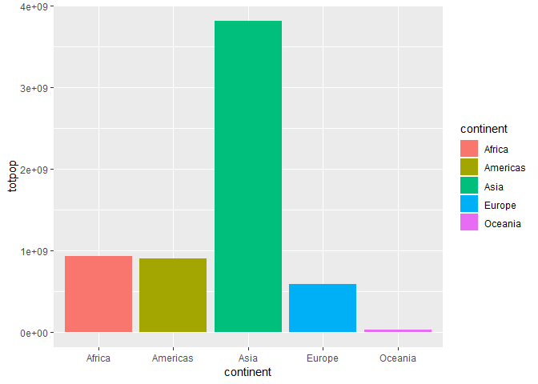
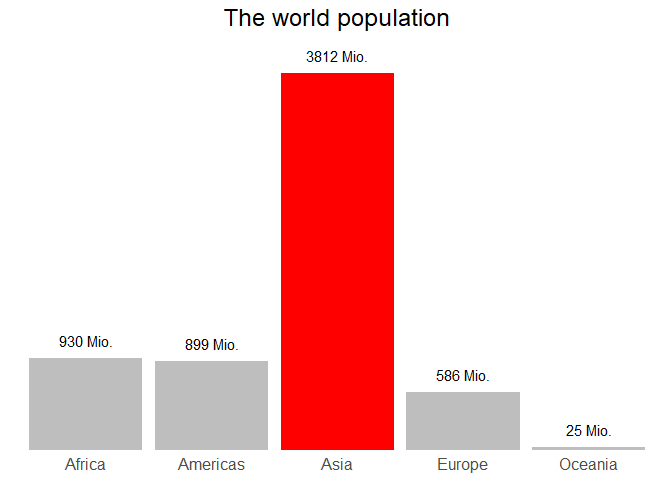
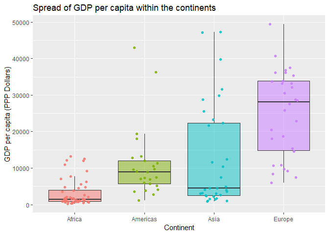

hw05
================
@RetoSterchi
October 18, 2018

Homework 05: Factor and figure management
=========================================

Part 1: Factor management
-------------------------

### First step: Load packages

``` r
require(gapminder)
require(ggplot2)
require(dplyr)
require(tidyr)
```

### Next step: Confirm data structure

Let's ensure that the data indeed contains factors.

``` r
str(gapminder)
```

    ## Classes 'tbl_df', 'tbl' and 'data.frame':    1704 obs. of  6 variables:
    ##  $ country  : Factor w/ 142 levels "Afghanistan",..: 1 1 1 1 1 1 1 1 1 1 ...
    ##  $ continent: Factor w/ 5 levels "Africa","Americas",..: 3 3 3 3 3 3 3 3 3 3 ...
    ##  $ year     : int  1952 1957 1962 1967 1972 1977 1982 1987 1992 1997 ...
    ##  $ lifeExp  : num  28.8 30.3 32 34 36.1 ...
    ##  $ pop      : int  8425333 9240934 10267083 11537966 13079460 14880372 12881816 13867957 16317921 22227415 ...
    ##  $ gdpPercap: num  779 821 853 836 740 ...

This makes sense - the dataset contains two variables that are factors: `country` and `continent`.

### Drop Oceania

Let's drop the 'Oceania' factor.

``` r
## Let's check the factor levels of the 'continent' variable
levels(gapminder$continent)
```

    ## [1] "Africa"   "Americas" "Asia"     "Europe"   "Oceania"

``` r
## Let's see how many rows there are in total our original dataset 
## and how many there are for the continent 'Oceania'
nrow(gapminder)
```

    ## [1] 1704

``` r
nrow(gapminder[gapminder$continent == "Oceania", ])
```

    ## [1] 24

``` r
## Let's remove the observations associated with 
## the 'continent' of Oceania and remove unused factor levels
gapminder %>% 
  filter(continent != "Oceania") %>% 
  droplevels() -> df

## Let's check whether those levels were dropped
levels(df$continent)
```

    ## [1] "Africa"   "Americas" "Asia"     "Europe"

``` r
## Let's see how many rows there are left in our manipulated dataset
nrow(df)
```

    ## [1] 1680

That all looks good. We had 1704 rows in our original dataset and remove the 24 rows associated with data from the continent 'Oceania'. We also cleaned up our factor levels and dropped the factor level for 'Oceania'.

### Reorder the levels

Let's use the forcats package to change the order of the factor levels.

``` r
## The default order of the factor levels is alphabetical
df$continent %>% levels()
```

    ## [1] "Africa"   "Americas" "Asia"     "Europe"

``` r
## Now let's install and use the `forcats` package to 
## change the order of the factor levels

# install.packages("forcats")
library(forcats)
```

    ## Warning: package 'forcats' was built under R version 3.4.4

``` r
## order by frequency
df$continent %>% 
  fct_infreq() %>%
  levels()
```

    ## [1] "Africa"   "Asia"     "Europe"   "Americas"

``` r
## backwards
df$continent %>% 
  fct_infreq() %>%
  fct_rev() %>% 
  levels()
```

    ## [1] "Americas" "Europe"   "Asia"     "Africa"

Now let's explore what the order of the factor levels has on plotting.

``` r
df %>% 
  ggplot(aes(x = continent, y = lifeExp, fill = continent)) + 
  geom_boxplot(outlier.shape = NA, alpha = 0.5) +
  ggtitle("Life expectancy for different continents") +
  xlab("Continent") +
  ylab("Life expectancy (years") + 
  theme(legend.position="none") # we dont need a legend
```



If we do not specify the ordering of the factors, the plotting function just assumes we want to plot in the default order of how the factors are ordered (which in our case is alphabetically).

``` r
df %>% 
  ggplot(aes(x = fct_infreq(continent), y = lifeExp , fill = continent)) + 
  geom_boxplot(outlier.shape = NA, alpha = 0.5) +
  ggtitle("Life expectancy for different continents") +
  xlab("Continent") +
  ylab("Life expectancy (years") + 
  theme(legend.position="none") # we dont need a legend
```



Re-ordering the factor will also determine the order of (in our case) the variables on the x-axis, because we only ordered by frequency of data points for each variables (continent).

If we just use `arrange()`, we will not permanently re-order the factors for plotting. The plotting function still grabs the order from the actual factor order.

``` r
df %>% 
  arrange(desc(continent)) %>% 
  ggplot(aes(x = continent, y = lifeExp, fill = continent)) + 
  geom_boxplot(outlier.shape = NA, alpha = 0.5) +
  ggtitle("Life expectancy for different continents") +
  xlab("Continent") +
  ylab("Life expectancy (years") + 
  theme(legend.position="none") # we dont need a legend
```


Part 2: File I/O
----------------

Let's explore some I/O options for saving and reading data files. First, we can save an R object into a RDS file. Note: files are stored under /data folder.

``` r
## Let's re-order the factor 'continent' to see how that 
## will be affected once we import the data again
## order by frequency
df$continent <- factor(df$continent, levels = c("Europe", "Americas", "Africa", "Asia"))

## Let's save our R object 'df' to a file (to the working directory)
saveRDS(object = df, file = "data/df.rds")

## We can read it back in
readRDS("data/df.rds")
```

    ## # A tibble: 1,680 x 6
    ##    country     continent  year lifeExp      pop gdpPercap
    ##    <fct>       <fct>     <int>   <dbl>    <int>     <dbl>
    ##  1 Afghanistan Asia       1952    28.8  8425333      779.
    ##  2 Afghanistan Asia       1957    30.3  9240934      821.
    ##  3 Afghanistan Asia       1962    32.0 10267083      853.
    ##  4 Afghanistan Asia       1967    34.0 11537966      836.
    ##  5 Afghanistan Asia       1972    36.1 13079460      740.
    ##  6 Afghanistan Asia       1977    38.4 14880372      786.
    ##  7 Afghanistan Asia       1982    39.9 12881816      978.
    ##  8 Afghanistan Asia       1987    40.8 13867957      852.
    ##  9 Afghanistan Asia       1992    41.7 16317921      649.
    ## 10 Afghanistan Asia       1997    41.8 22227415      635.
    ## # ... with 1,670 more rows

``` r
## and assign it to a variable
df <- readRDS("data/df.rds")

## Let's check out the factor levels - Looks like our order was preserved
levels(df$continent)
```

    ## [1] "Europe"   "Americas" "Africa"   "Asia"

Note: There is also a function `save()`. The main difference is that save() can save many objects to a file in a single call, whilst saveRDS(), being a lower-level function, works with a single object at a time.

The same thing works with writing data to a .CSV file:

``` r
write.csv(df, file="data/df.csv")

df <- read.csv("data/df.csv")

## Let's have a look at the imported df. The variables still look the same.
str(df)
```

    ## 'data.frame':    1680 obs. of  7 variables:
    ##  $ X        : int  1 2 3 4 5 6 7 8 9 10 ...
    ##  $ country  : Factor w/ 140 levels "Afghanistan",..: 1 1 1 1 1 1 1 1 1 1 ...
    ##  $ continent: Factor w/ 4 levels "Africa","Americas",..: 3 3 3 3 3 3 3 3 3 3 ...
    ##  $ year     : int  1952 1957 1962 1967 1972 1977 1982 1987 1992 1997 ...
    ##  $ lifeExp  : num  28.8 30.3 32 34 36.1 ...
    ##  $ pop      : int  8425333 9240934 10267083 11537966 13079460 14880372 12881816 13867957 16317921 22227415 ...
    ##  $ gdpPercap: num  779 821 853 836 740 ...

``` r
## But the .CSV file contains a column for the row number ('X') 
## that was produced when storing the .CSV. We can omit that.
df <- df[,-1]
str(df)
```

    ## 'data.frame':    1680 obs. of  6 variables:
    ##  $ country  : Factor w/ 140 levels "Afghanistan",..: 1 1 1 1 1 1 1 1 1 1 ...
    ##  $ continent: Factor w/ 4 levels "Africa","Americas",..: 3 3 3 3 3 3 3 3 3 3 ...
    ##  $ year     : int  1952 1957 1962 1967 1972 1977 1982 1987 1992 1997 ...
    ##  $ lifeExp  : num  28.8 30.3 32 34 36.1 ...
    ##  $ pop      : int  8425333 9240934 10267083 11537966 13079460 14880372 12881816 13867957 16317921 22227415 ...
    ##  $ gdpPercap: num  779 821 853 836 740 ...

``` r
## Once again, let's check out the factor levels - Looks like importing 
## a CSV file makes a default order (alphabetically). That makes sense 
## since the factor order was not stored in the .CSV.
levels(df$continent)
```

    ## [1] "Africa"   "Americas" "Asia"     "Europe"

Part 3: Visualization design
----------------------------

Remake at least one figure or create a new one, in light of something you learned in the recent class meetings about visualization design and color. Maybe juxtapose your first attempt and what you obtained after some time spent working on it. Reflect on the differences. If using Gapminder, you can use the country or continent color scheme that ships with Gapminder. Consult the dimensions listed in [All the Graph Things](http://stat545.com/graph00_index.html).

Let's juxtapose two graphs that have the same content but are designed differently. I followed some guidelines of <http://stat545.com/block015_graph-dos-donts.html> for this exercise.

``` r
## Prepare data
gapminder %>% 
  filter(year == 2007) %>% 
  group_by(continent) %>% 
  summarise(totpop = sum(as.numeric(pop))) -> plotDF

## Plot 1: Just going with the defaults
p1 <- ggplot(data = plotDF, aes(x = continent, y = totpop, fill = continent)) +
      geom_col()
```

Now on to the second version of the plot.

``` r
## Plot 2: Let's do a little tuning with stripping the graphic down to the necessary

## Let's set up the basic plot
p2 <- ggplot(data = plotDF, aes(x = continent, y = totpop, fill = continent)) + 
  geom_col() +
  theme_classic() + # clean BW theme
  theme(legend.position="none") + # we dont need a legend
  ggtitle("The world population") # add a descriptive title

## Add data labels
p2 <- p2 + geom_text(aes(x = continent, y = totpop, 
                label = paste0(round(totpop / 1000000, 0), " Mio.")),
                vjust = -1)

## More room for label over the bar
ylim <- c(0, max(plotDF$totpop * 1.1))
p2 <- p2 + scale_y_continuous(expand = c(0,0), limits = ylim)

## Use custom colors
p2 <- p2 +  scale_fill_manual(values = c("grey", "grey", "red", "grey", "grey"))

## Remove redundant information and labels
p2 <- p2 +  theme(axis.line = element_blank(), # remove border
                axis.title.x = element_blank(), # remove x-axis title
                axis.ticks.x = element_blank(), # remove x-axis ticks
                axis.title.y = element_blank(), # remove y-axis title
                axis.ticks.y = element_blank(), # remove y-axis ticks
                axis.text.y  = element_blank(), # remove y-axis labels
                axis.text = element_text(size = 12), # make font bigger
                plot.title = element_text(size = 18, hjust = 0.5)) # bigger font and centered
```

Now let's plot the two versions

``` r
## Plot them both    
p1
```



``` r
p2
```



We cleaned up the second plot very nicely! It is pretty easy for the reader to get the key point of the plot very quickly and all the numbers and labels are readily accessible.

Then, let's make a new graph with`plotly`.

``` r
library(plotly)

p <- plot_ly(
  x = plotDF$continent,
  y = plotDF$totpop,
  type = "bar"
)

p
```

<!--html_preserve-->

<script type="application/json" data-for="325c76d56886">{"x":{"visdat":{"325c504e7e05":["function () ","plotlyVisDat"]},"cur_data":"325c504e7e05","attrs":{"325c504e7e05":{"x":["Africa","Americas","Asia","Europe","Oceania"],"y":[929539692,898871184,3811953827,586098529,24549947],"alpha":1,"sizes":[10,100],"type":"bar"}},"layout":{"margin":{"b":40,"l":60,"t":25,"r":10},"xaxis":{"domain":[0,1],"type":"category","categoryorder":"array","categoryarray":["Africa","Americas","Asia","Europe","Oceania"]},"yaxis":{"domain":[0,1]},"hovermode":"closest","showlegend":false},"source":"A","config":{"modeBarButtonsToAdd":[{"name":"Collaborate","icon":{"width":1000,"ascent":500,"descent":-50,"path":"M487 375c7-10 9-23 5-36l-79-259c-3-12-11-23-22-31-11-8-22-12-35-12l-263 0c-15 0-29 5-43 15-13 10-23 23-28 37-5 13-5 25-1 37 0 0 0 3 1 7 1 5 1 8 1 11 0 2 0 4-1 6 0 3-1 5-1 6 1 2 2 4 3 6 1 2 2 4 4 6 2 3 4 5 5 7 5 7 9 16 13 26 4 10 7 19 9 26 0 2 0 5 0 9-1 4-1 6 0 8 0 2 2 5 4 8 3 3 5 5 5 7 4 6 8 15 12 26 4 11 7 19 7 26 1 1 0 4 0 9-1 4-1 7 0 8 1 2 3 5 6 8 4 4 6 6 6 7 4 5 8 13 13 24 4 11 7 20 7 28 1 1 0 4 0 7-1 3-1 6-1 7 0 2 1 4 3 6 1 1 3 4 5 6 2 3 3 5 5 6 1 2 3 5 4 9 2 3 3 7 5 10 1 3 2 6 4 10 2 4 4 7 6 9 2 3 4 5 7 7 3 2 7 3 11 3 3 0 8 0 13-1l0-1c7 2 12 2 14 2l218 0c14 0 25-5 32-16 8-10 10-23 6-37l-79-259c-7-22-13-37-20-43-7-7-19-10-37-10l-248 0c-5 0-9-2-11-5-2-3-2-7 0-12 4-13 18-20 41-20l264 0c5 0 10 2 16 5 5 3 8 6 10 11l85 282c2 5 2 10 2 17 7-3 13-7 17-13z m-304 0c-1-3-1-5 0-7 1-1 3-2 6-2l174 0c2 0 4 1 7 2 2 2 4 4 5 7l6 18c0 3 0 5-1 7-1 1-3 2-6 2l-173 0c-3 0-5-1-8-2-2-2-4-4-4-7z m-24-73c-1-3-1-5 0-7 2-2 3-2 6-2l174 0c2 0 5 0 7 2 3 2 4 4 5 7l6 18c1 2 0 5-1 6-1 2-3 3-5 3l-174 0c-3 0-5-1-7-3-3-1-4-4-5-6z"},"click":"function(gd) { \n        // is this being viewed in RStudio?\n        if (location.search == '?viewer_pane=1') {\n          alert('To learn about plotly for collaboration, visit:\\n https://cpsievert.github.io/plotly_book/plot-ly-for-collaboration.html');\n        } else {\n          window.open('https://cpsievert.github.io/plotly_book/plot-ly-for-collaboration.html', '_blank');\n        }\n      }"}],"cloud":false},"data":[{"x":["Africa","Americas","Asia","Europe","Oceania"],"y":[929539692,898871184,3811953827,586098529,24549947],"type":"bar","marker":{"fillcolor":"rgba(31,119,180,1)","color":"rgba(31,119,180,1)","line":{"color":"transparent"}},"xaxis":"x","yaxis":"y","frame":null}],"highlight":{"on":"plotly_click","persistent":false,"dynamic":false,"selectize":false,"opacityDim":0.2,"selected":{"opacity":1}},"base_url":"https://plot.ly"},"evals":["config.modeBarButtonsToAdd.0.click"],"jsHooks":{"render":[{"code":"function(el, x) { var ctConfig = crosstalk.var('plotlyCrosstalkOpts').set({\"on\":\"plotly_click\",\"persistent\":false,\"dynamic\":false,\"selectize\":false,\"opacityDim\":0.2,\"selected\":{\"opacity\":1}}); }","data":null}]}}</script>
<!--/html_preserve-->
Note: plotly graph does not work in markdown and would need HTML file (not compiled for this homework).

Plotly lets us zoom in or out of the graph and we can hover over data points to get their values. Two options that can be very valuable for data exploration purposes.

Part 4: Writing figures to file
-------------------------------

Let's explore some of the possibilities of \`ggsave()' for saving plots. All plot outputs are stored in the repo folder /plots.

``` r
df %>% 
  filter(year == 2007) %>% 
  group_by(continent) %>% 
  ggplot(aes(x = continent, y = gdpPercap, fill = continent)) +
  geom_boxplot(outlier.shape = NA, alpha = 0.5) +
  geom_jitter(width = 0.2, aes(colour = continent), alpha = 0.8) +
  ggtitle("Spread of GDP per capita within the continents") +
  xlab("Continent") +
  ylab("GDP per capita (PPP Dollars)") +
  theme(legend.position="none") # we dont need a legend
```



``` r
## default: plotting of the last plot made, size 7x7 inches
ggsave(filename = "plots/plot1.pdf") 

## specify width and height
ggsave(filename = "plots/plot2.pdf", width = 10, height = 6) 

## change resolution, no effects since our plot is not a raster
ggsave(filename = "plots/plot3.pdf", dpi = 100) 

## resolution can be changed for raster images
ggsave(filename = "plots/plot3.png", dpi = 100) 

## Depending on the workflow, we can build up the plot layer by layer 
## and store it into an object. This can then be passed to the ggsave() function

p <- ggplot(df, aes(x = continent, y = lifeExp, colour = continent)) + 
      geom_boxplot(outlier.shape = NA, alpha = 0.5)
p <- p + geom_jitter()
p <- p + ggtitle("Spread of GDP per capita within the continents")
p <- p + xlab("Continent")
p <- p + ylab("GDP per capita (PPP Dollars)")
p <- p + theme(legend.position="none") # we dont need a legend

ggsave(p, filename = "plots/plot4.pdf") 
```

Now, let's embed the last graph into our report here with ``


### Finishing up, and Reflection
